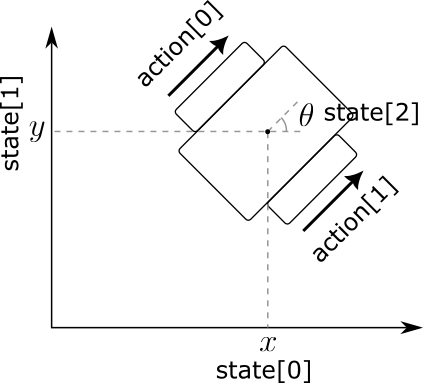
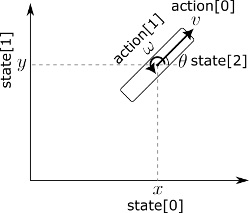

# SE2 Kinematic Environment

## SE2BaseEnv Class
This repository contains a SE(2) (Special Euclidean 2D) kinematic environment implemented using the OpenAI Gym library. The SE2 environment is designed to simulate the motion of an agent within a specified world space, taking into account potential fields, obstacles, and other parameters. It is an abstract class and cannot be used alone. The observation space is the position and the orientation of the car (x,y,theta). The derived classes should implement the action space.

### Initialization
The SE2BaseEnv class is the main SE2 environment class. It is initialized with the following parameters:

- `pot_field`: Potential Field class.
- `init_pos`: Initial position of the car-like robot.
- `agent_size`: Size of the car-like robot (height, width).
- `reward_weight`: Weighting factors for rewards.
- `suc_tol`: Tolerance for the success (reaching the target).
- `render_mode`: Rendering mode for the Gym environment.

### Methods
- `reset(seed=None, options=None)`: Reset the environment to a new episode.
- `step(action)`: Take a step in the environment given an action.
- `render()`: Render the environment.
- `plot(ispotential=False)`: Plot the trajectory of the agent and target.
- `close()`: Close the environment.

## DiffDriveEnv Class
### Initialization

The DiffDriveEnv class is based on the SE2BaseEnv class, specifically designed for a differential drive car. It introduces additional parameters:

- `wheel_speed_limit`: Limits for the left and right wheel speeds.
- `wheel_size`: Size of the wheels.
- `action_space`: Action space for controlling the left and right wheel speeds.

### Methods

- `clip_action(action)`: Clip the action to the action space.
- `get_action_SE2(action)`: Transform the action to the motion (x,y,theta).

## UnicycleEnv Class
### Initialization
The UnicycleEnv class is an extension of the SE2BaseEnv class, specifically designed for a unicycle-like agent. It introduces additional parameters:

- `speed_limit`: Limits for the forward velocity and angular velocity. (4x1 numpy array).
- `action_space`: Action space for controlling the forward velocity and angular velocity.

### Methods

- `clip_action(action)`: Clip the action to the action space.
- `get_action_SE2(action)`: Transform action indices to the motion (x,y,theta).

## Dependencies

Make sure you have the following dependencies installed:

- `numpy`
- `scipy`
- `matplotlib`
- `pygame`

## Installation

Clone the repository and navigate to the project directory:

